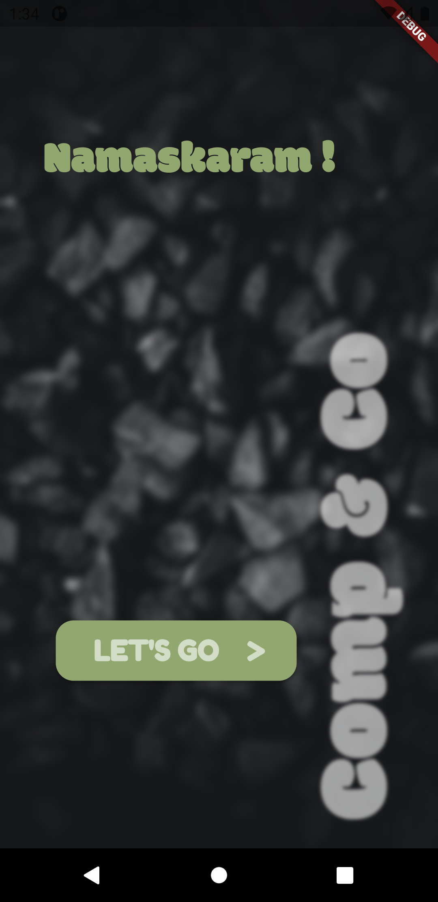
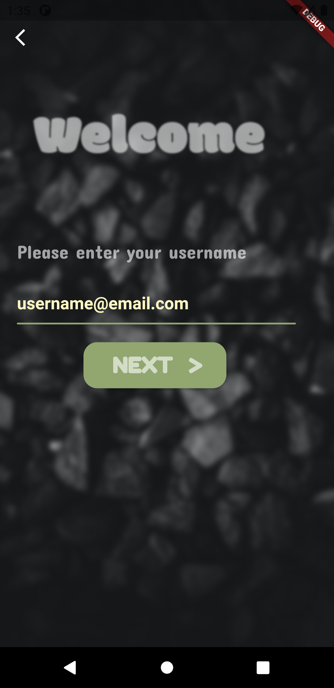
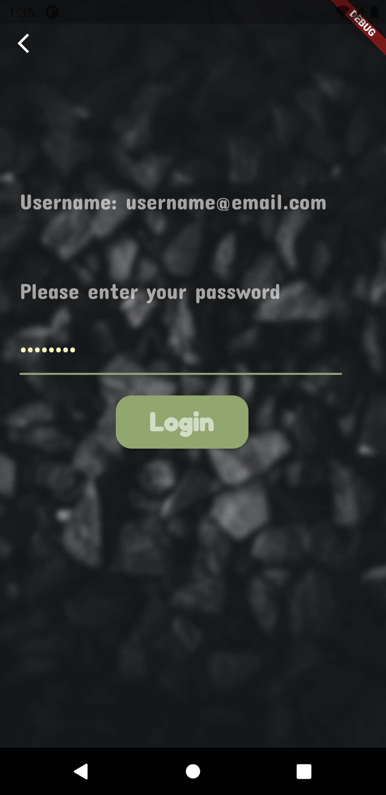
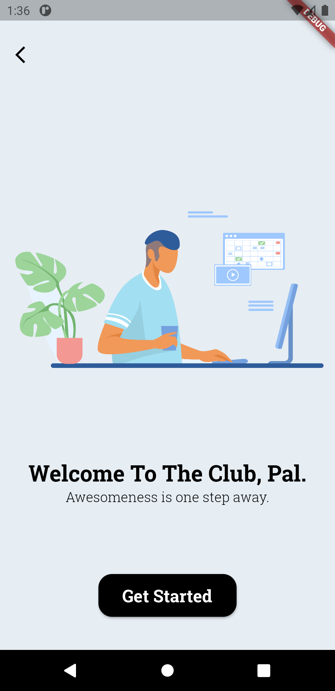
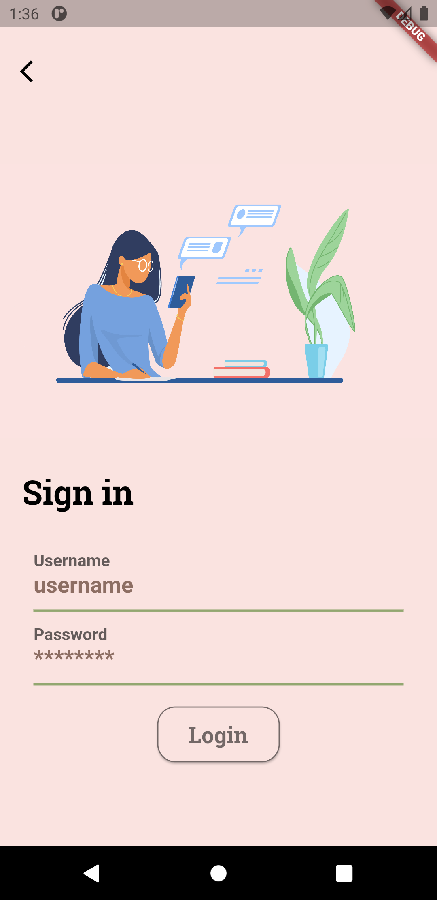
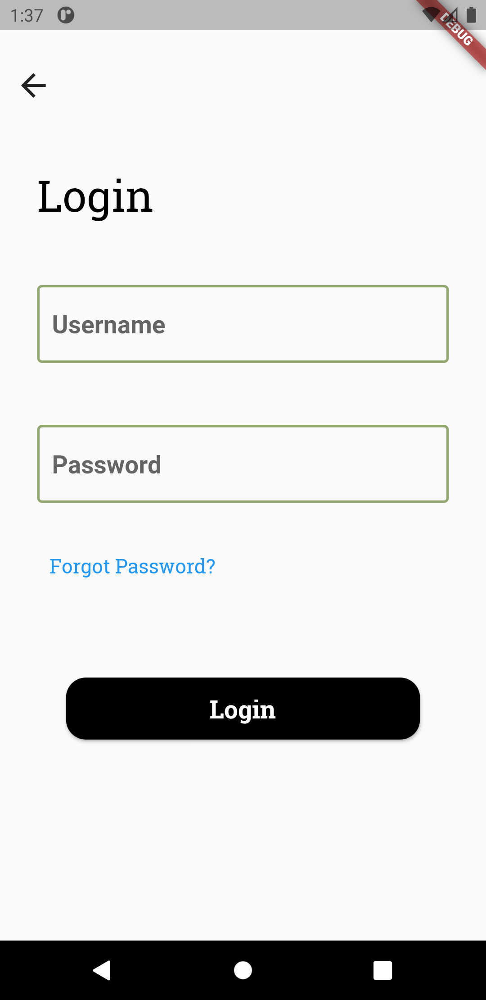
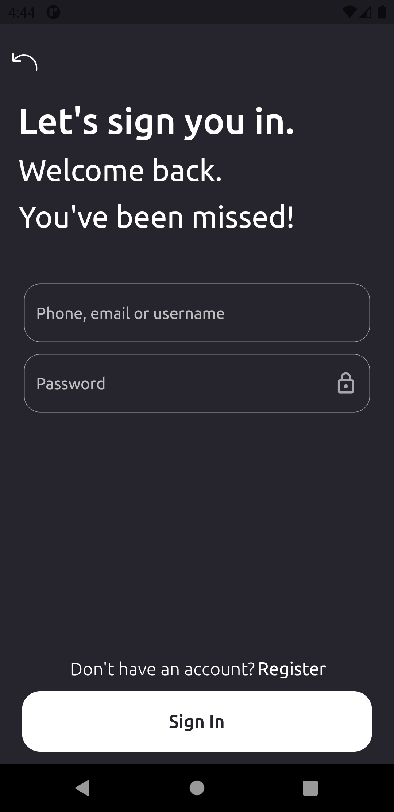
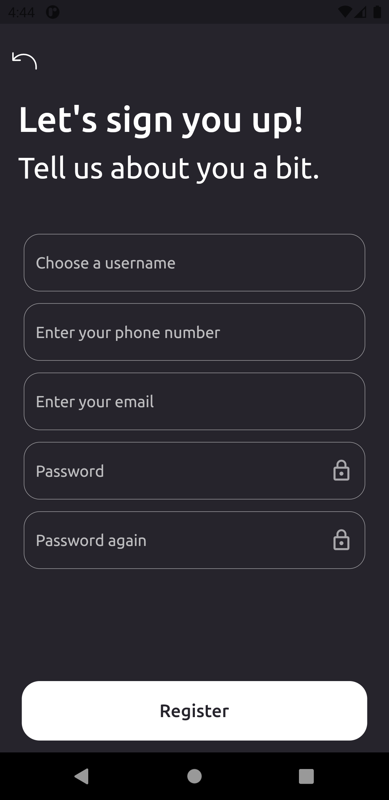

# loginUis

A project containing a collection of Login User Interfaces to use.

## Previews :

### Login 1 :

  
  
  
 
 ### Login 2 :

  
  
 
 ### Login 3 :

  

 ### Login 4 :

  
  
  
  

